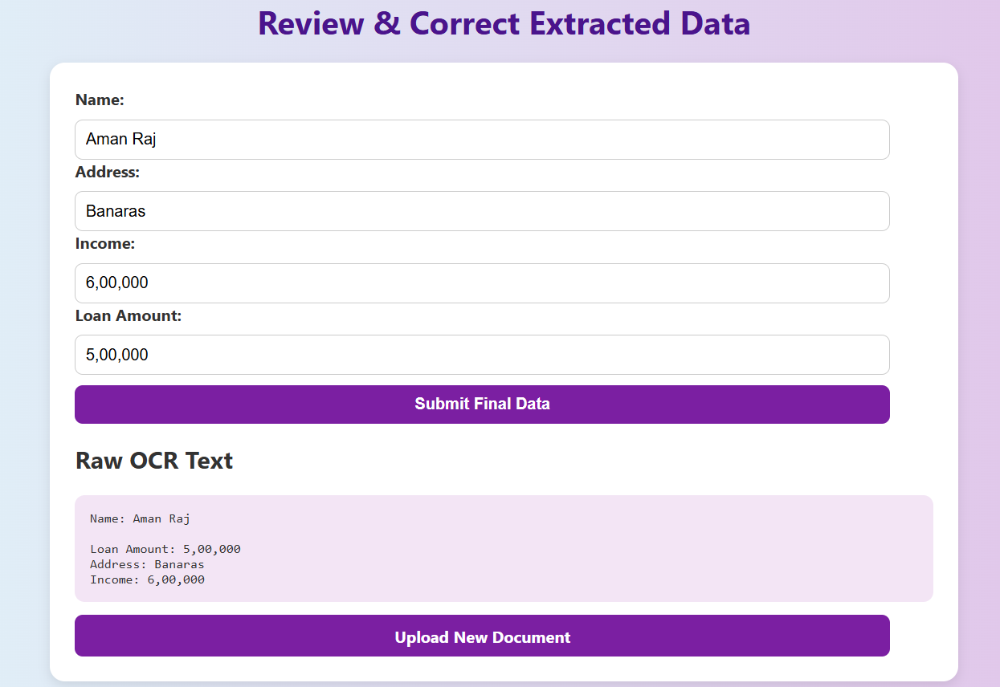

# 📄 Automated Personal Loan Document Processing Using OCR

This Node.js application automates the extraction and processing of key fields (Name, Address, Income, Loan Amount) from scanned or uploaded personal loan application documents using OCR. It features image preprocessing, manual correction, data validation, and MongoDB cloud storage integration.

---

## 🧩 Solution Features

The project addresses key inefficiencies in manual loan processing by automating the following:

- 📥 Scanned document intake with file upload
- 🧼 Image preprocessing to enhance OCR results
- 🔎 Text extraction using Tesseract OCR
- ✍️ Manual correction UI to fix extraction errors
- ✅ Data validation to prevent incorrect submissions
- ☁️ Data integration into MongoDB for backend processing

---

## 🚀 Features

- 📤 Upload scanned loan application images
- 🧼 Preprocess images using Sharp (grayscale, normalization)
- 🔍 Extract text using Tesseract.js (OCR)
- ✍️ Manual correction of extracted fields (Name, Address, Income, Loan Amount)
- ✅ Validation with express-validator
- ☁️ Save validated applications in MongoDB Atlas

---

## ✅ Final Feature Review

| Feature                 | ✅ Status | 🔍 Details                                                                 |
|--------------------------|-----------|----------------------------------------------------------------------------|
| Manual correction UI ✍️  | ✅ Done   | result.ejs allows users to review and edit OCR-extracted data              |
| Image preprocessing 🧼   | ✅ Done   | sharp is used to grayscale and normalize images before OCR                 |
| Field-level validation ✅ | ✅ Done   | Now uses express-validator for strict format and length checks            |
| Backend integration ☁️   | ✅ Done   | Data is saved in MongoDB Atlas using a secure .env connection             |

---

## 🧰 Tech Stack

- Node.js & Express.js
- EJS (templating engine)
- Tesseract.js (OCR)
- Sharp (image preprocessing)
- Multer (file upload middleware)
- MongoDB Atlas (cloud database)
- Mongoose (ODM)
- express-validator (form validation)

---

## 📂 Folder Structure

```
loan-ocr-app/
│
├── models/               # Mongoose schema
│   └── Application.js
├── public/               # Optional: static assets
├── uploads/              # Uploaded documents (temporary)
├── processed/            # Preprocessed image output (temporary)
├── views/                # EJS templates
│   ├── index.ejs
│   ├── result.ejs
│   └── success.ejs
├── .env                  # Contains MongoDB URI (not committed)
├── .gitignore
├── app.js                # Main application file
└── README.md             # Project description
```

---

## 📦 Installation & Setup

1. Clone the repository

```bash
git clone https://github.com/your-username/loan-ocr-app.git
cd loan-ocr-app
```

2. Install dependencies

```bash
npm install
```

3. Create a `.env` file and add your MongoDB Atlas URI:

```env
MONGO_URI=mongodb+srv://<username>:<password>@clustername.mongodb.net/loanocr?retryWrites=true&w=majority
```

4. Run the application

```bash
node app.js
```

Then open http://localhost:3000 in your browser.

---

## 🖥️ How it Works

- Upload a scanned loan document
- App uses Sharp to preprocess the image (grayscale, normalize)
- Tesseract.js extracts raw text
- Regex-based extraction isolates key fields
- Fields are displayed for manual correction
- Validated form data is saved to MongoDB

---

## 🎥 Demo

You can view the recorded demo video with voiceover here:

📹 [Demo Video Link](#) ← Replace this with your video URL

---

## 📄 Report

See the attached PDF for full details:
📘 OCR_Loan_Processing_Project_Report.pdf

---

## 📌 Future Enhancements

- Use AI models like LayoutLM for layout-aware field extraction
- Export data to PDF or Excel
- Admin dashboard to view & manage submissions
- User authentication for staff and admins

---

## 👨‍💻 Author

**Aman Raj**  
GitHub: [https://github.com/your-username](https://github.com/your-username)

---


---

## 🖼️ UI Preview

Below is a screenshot of the Review & Correct Extracted Data form where users can manually verify and edit the OCR-extracted information:


